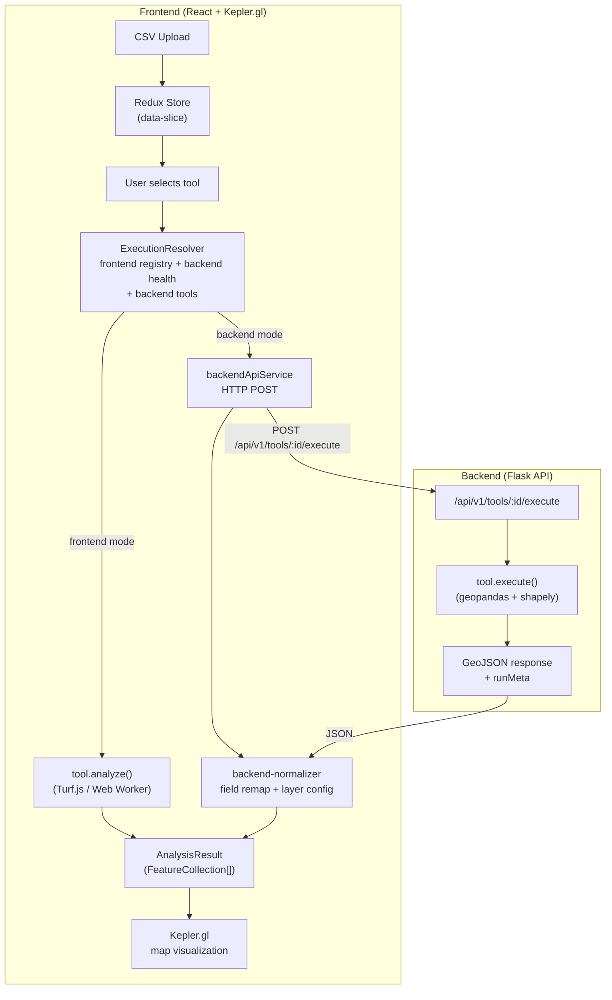

# Time Geography Kepler

A geospatial analysis platform built on [Kepler.gl](https://kepler.gl/) for space-time trajectory analysis. Upload CSV data, run analysis tools in the browser or on an optional server, and visualize results on an interactive map.

The platform ships six tools -- STKDE, Time Geography, Space-Time Cube, Buffer, Union, and Intersection -- each capable of running client-side (Turf.js) or server-side (geopandas), depending on its execution policy.

## Architecture



## Tech Stack

| Layer | Technology | Purpose |
|-------|-----------|---------|
| UI Framework | React 18 + TypeScript | Component architecture |
| Bundler | Vite 6 | Dev server and production builds |
| Map Engine | Kepler.gl 3.1 | WebGL geospatial visualization |
| State | Redux Toolkit | Centralized app state |
| Geospatial (browser) | Turf.js 7 | Client-side spatial analysis |
| Styling | Tailwind CSS 4 | Utility-first CSS |
| UI Primitives | Radix UI + shadcn/ui | Accessible component library |
| Backend Framework | Flask 3 | Stateless REST API |
| Geospatial (server) | geopandas 1.x + Shapely 2 | Server-side spatial analysis |
| Statistics | SciPy 1.12+ | Kernel density estimation, spatial stats |
| Package Manager (Python) | uv | Fast dependency resolution |

## Quick Start

### Prerequisites

- **Node.js** (see `volta` config in `package.json` for pinned version)
- **Python >= 3.12**
- **uv** ([install guide](https://docs.astral.sh/uv/getting-started/installation/))

### Frontend

```bash
cd app/front-end
cp ../../.env.example .env        # configure environment
npm install
npm run dev                       # Vite dev server on http://localhost:5173
```

The frontend works fully offline. All tools have browser implementations or are gracefully disabled when the backend is unavailable.

### Backend (optional)

```bash
cd app/back-end
uv sync                              # install dependencies
uv run flask --app app run -p 8000   # start Flask on http://localhost:8000
```

When the backend is running, the frontend detects it via `/api/v1/health` and enables server-side execution for hybrid tools.

### Environment Variables

| Variable | Default | Description |
|----------|---------|-------------|
| `VITE_APP_MODE` | `frontend` | Application mode |
| `VITE_BACKEND_URL` | `http://localhost:8000` | Flask backend URL |

## API Endpoints

All endpoints are prefixed with `/api/v1`.

| Method | Path | Description |
|--------|------|-------------|
| `GET` | `/health` | Health check. Returns `{ "status": "healthy", "version": "1.0.0" }` |
| `GET` | `/tools` | List registered tools with id, name, description, version, and executionPolicy |
| `POST` | `/tools/{toolId}/execute` | Execute a tool. Body: `{ data, options, attributes, sourceDatasetIds }`. Returns GeoJSON `FeatureCollection[]` with `runMeta` |

Error responses return HTTP 400/404 with `{ "success": false, "error": "...", "outputs": [] }`.

## Tools

| ID | Name | Policy | Description |
|----|------|--------|-------------|
| `stkde` | Space-Time KDE | `hybrid` | Space-time kernel density estimation |
| `time-geography` | Time Geography | `hybrid` | Space-time prisms and potential path areas |
| `space-time-cube` | Space-Time Cube | `hybrid` | Aggregate trajectory points into 3D bins |
| `buffer` | Buffer | `hybrid` | Generate buffer zones around features |
| `union` | Union | `hybrid` | Merge overlapping geometries |
| `intersection` | Intersection | `hybrid` | Compute geometric intersections |

**Execution policies:**
- `frontend_only` -- runs exclusively in the browser
- `backend_only` -- requires the Flask backend
- `hybrid` -- can run in either mode; the user selects via a mode toggle

## Project Structure

```
time-geography-kepler/
├── .env.example                          # Environment variable template
├── CLAUDE.md                             # Root-level AI coding instructions
├── app/
│   ├── front-end/
│   │   ├── src/
│   │   │   ├── components/               # React components (UI, workflow, panels)
│   │   │   ├── contexts/                 # React contexts (app state, color schemes)
│   │   │   ├── data-processors/          # Output post-processing (e.g. STKDE)
│   │   │   ├── hooks/                    # Custom hooks (backend init, keyboard shortcuts)
│   │   │   ├── interfaces/               # TypeScript types (SimpleTool, GeoJSON, etc.)
│   │   │   ├── lib/                      # Shared utilities
│   │   │   ├── services/                 # Execution layer
│   │   │   │   ├── analysis-engine.ts    #   Entry point for all tool runs
│   │   │   │   ├── backend-api-service.ts#   HTTP client for Flask API
│   │   │   │   ├── backend-normalizer.ts #   Backend response → frontend format
│   │   │   │   └── execution-resolver.ts #   Determines available execution modes
│   │   │   ├── stores/                   # Redux slices (data, settings, workflow)
│   │   │   ├── tools/                    # Tool implementations (SimpleTool classes)
│   │   │   ├── utils/                    # Constants, tool registry, data helpers
│   │   │   └── visualization-templates/  # Kepler.gl layer config JSON per tool
│   │   ├── package.json
│   │   ├── vite.config.ts
│   │   └── tsconfig.json
│   └── back-end/
│       ├── app/
│       │   ├── __init__.py               # Flask app factory (create_app)
│       │   ├── routes.py                 # API blueprint (/api/v1)
│       │   ├── tool_registry.py          # Singleton tool registry
│       │   ├── utils.py                  # GeoJSON <-> GeoDataFrame converters
│       │   ├── constants.py              # Shared constants
│       │   └── tools/                    # Tool implementations (BaseTool subclasses)
│       │       ├── base.py               #   Abstract base class
│       │       ├── stkde.py
│       │       ├── time_geography.py
│       │       ├── space_time_cube.py
│       │       ├── buffer.py
│       │       ├── union.py
│       │       └── intersection.py
│       ├── tests/                        # pytest test suite
│       └── pyproject.toml
```

## Development

### Frontend

```bash
cd app/front-end
npm run dev          # Start dev server with HMR
npm run build        # Type-check (tsc) then bundle (Vite)
npm run lint         # ESLint
npm run preview      # Preview production build locally
```

### Backend

```bash
cd app/back-end
uv sync                              # Install / update dependencies
uv run flask --app app run -p 8000   # Start dev server
uv run pytest tests/                 # Run test suite
```

### Adding a New Tool

1. **Frontend:** Create `src/tools/<name>-tool.ts` implementing `SimpleTool`, set `executionPolicy` in `capabilities`, register in `src/tools/index.ts`, and add a normalizer case in `backend-normalizer.ts` if the tool supports backend execution.
2. **Backend:** Create `app/tools/<name>.py` subclassing `BaseTool`, implement `execute()`, and register in `app/tool_registry.py`.
3. **Both:** Keep the API contract in sync between the two codebases.

## License

This project is private.
